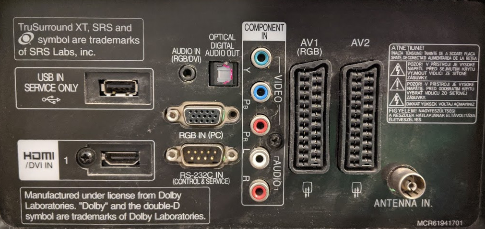

lilo-lg README
==============

Prior to the days of HDMI-CEC (or whatever your favoured manufacturer 
[wants to call it](https://www.howtogeek.com/207186/how-to-enable-hdmi-cec-on-your-tv-and-why-you-should/)) 
many LG TVs came equiped with an RS232 port
over which could be sent control commands

I decided it should be possible to hack LILO to send the control code 
for power-on as soon as it runs, which will allow the TV to start its 
boot sequence while the kernel is loading.  This may not catch everything but 
it'll surely be better than waiting for run level 3 before issuing the power
on command.

This hack relies on your PC having a motherboard with a hardware serial 
port (a USB converter won't work).  Although there are probably now no modern
motherboards with the back-panel serial port connector you can
usually buy a back-panel adapter if you have the motherboard connector,
which many motherboards still retain.

